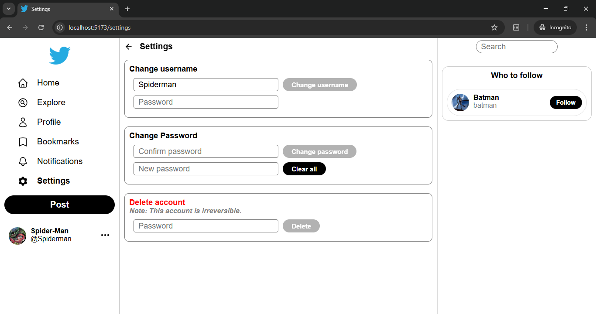

# Twitter Clone Backend & Frontend

> **Status:** This project is based on a [previous microservice based project](https://github.com/shawshank725/twitter-clone-spring-boot-react-microservices). This project just introduces modulith architecture and fixes existing issues and can be deployed easily.

This is a **modulith-architecture based Twitter clone** built with **Spring Boot**, **Java**, **React.js** and **NeonDB (PostgreSQL)** as the database.  
It supports real-time interactions using **WebSockets** (for notifications) and includes advanced features like image cropping, open-feign clients, MySQL triggers (initially), and a fully functional timeline system.

---

## Tech Stack
- **Backend**: Spring Boot (Java), WebSockets, MySQL triggers (for some logic), Modulith, Session Based authentication
- **Frontend**: React, Vite, TanStack Query, React Easy Crop
- **Database**: NeonDB (PostgreSQL), MySQL

---

## Project Structure
```text
Backend
├── Authentication Module
├── Posting Module
│   ├── Posts
│   ├── Likes
│   └── Bookmarks
├── Connection Module
├── Notification Module
├── Timeline Module
└── Media Module

Frontend
```
---

<h2>Architecture Comparison</h2>

<table>
  <thead>
    <tr>
      <th>Metric</th>
      <th>Microservices Version</th>
      <th>Modulith Version</th>
    </tr>
  </thead>
  <tbody>
    <tr>
      <td>Number of Services</td>
      <td>8</td>
      <td>1</td>
    </tr>
    <tr>
      <td>Source Files</td>
      <td>256</td>
      <td>204</td>
    </tr>
    <tr>
      <td>Lines of Code</td>
      <td>15,556</td>
      <td>14,693</td>
    </tr>
    <tr>
      <td>Inter-Service Communication</td>
      <td>REST API Calls</td>
      <td>In-Process Calls</td>
    </tr>
    <tr>
      <td>API Calls Between Components</td>
      <td>Higher</td>
      <td>Lower</td>
    </tr>
    <tr>
      <td>Deployment Units</td>
      <td>8 Services</td>
      <td>1 Application</td>
    </tr>
    <tr>
      <td>Operational Complexity</td>
      <td>Higher</td>
      <td>Lower</td>
    </tr>
    <tr>
      <td>Local Development Setup</td>
      <td>More Complex</td>
      <td>Simpler</td>
    </tr>
    <tr>
      <td>Debugging</td>
      <td>Distributed</td>
      <td>Centralized</td>
    </tr>
  </tbody>
</table>

---

## Prerequisites

- Java 21
- Node.js
- MySQL Server
- MySQL Workbench
- Cloudinary Account
- Giphy API Key

---


### 1. Fork or Clone the Repository

```bash
git clone https://github.com/shawshank725/twitter
cd twitter
```

### 2. Set Up the Database

1. Install MySQL Server and MySQL Workbench.
2. Open the `sql-scripts` folder.
3. Execute all SQL scripts one by one.
4. By default, the application uses a database named `twitter`.

If you change the database name, make sure to update both:
- The SQL scripts
- `application.properties`

### 3. Set Up the Frontend

Open the `frontend` folder in VS Code (or any preferred code editor).

Install dependencies:

```bash
npm install
```

Create a `.env` file inside the `frontend` directory:

```env
VITE_GIPHY_API=your_giphy_api_key
VITE_SPRING_BOOT_APP=http://localhost:8080
```
You can either use it locally and set this as localhost OR you can deploy the backend on render or any other service and paste the URL here.

### 4. Set Up the Backend

Open the `backend` folder in IntelliJ IDEA (recommended) or another Java IDE.

Import the project and allow Maven to download all dependencies.

Create a `.env` file in the root of the `backend` directory:

```env
CLOUDINARY_CLOUD_NAME=your_cloud_name
CLOUDINARY_API_KEY=your_api_key
CLOUDINARY_API_SECRET=your_api_secret
```

Open `application.properties` and configure your database credentials:

```properties
spring.datasource.username=your_username
spring.datasource.password=your_password
spring.datasource.url=jdbc:mysql://localhost:3306/twitter
```

### 5. Run the Backend

Start the Spring Boot application from your IDE.

### 6. Run the Frontend

From the `frontend` directory:

```bash
npm run dev
```

### 7. Register an Account

Open:

```text
http://localhost:5173/auth
```

Create an account and start using the application.

---

## Algorithms & Flows

### 🔹 Timeline Generation
1. Connection service returns a list of followers & followees (given a user id).  
2. Deduplicate into a **set**.  
3. Another endpoint fetches **post IDs** for this set.  
4. Send post IDs to frontend → frontend maps & displays posts.  
5. Show first 10 posts → then "Show more" appends 10 more.  
6. If <10 posts → display global feed.  

### 🔹 Suggested People to Follow
1. Get list of users the logged-in user already follows.  
2. Fetch all users (excluding self).  
3. Compute: `All users – Followed users = Not Followed`.  
4. Display max 4 at a time in frontend (React Query).  
5. Once a user is followed, remove from list & replace with next.  

### 🔹 Settings Page Includes
- Change username  
- Change password  
- Delete account  

🔹 **Change Username**  
- Check backend if new username is already taken.  
- Show green tick if available, red cross if not.  
- Backend endpoint validates & updates.  

---

## Added Features & Fixes
1. User authentication, logout, account deletion, and password validation
2. Create, reply to, delete, like, bookmark, and quote-retweet posts
3. Personalized timeline with profile posts, bookmarks, and private likes
4. Follow / unfollow system
5. Notification system for likes, follows, replies, and quote retweets
6. User profile management with profile editing, photo cropping, profile/background photo removal, joined date display, and username validation
7. Advanced post viewing with parent post navigation, post modal, clickable posts, quote-retweet viewer, and custom photo viewer
8. Search functionality
9. Settings page
10. Tab-based navigation and improved profile layout
11. Rich post formatting and improved date formatting
12. Enhanced user experience through empty-state messages, UI fixes, sidebar improvements, and project restructuring

---
## Screenshots

<h3>Home Page & Profile Page</h3>

<p>
  
  
</p>

<h3>Settings & Likes</h3>

<p>
  
  
</p>

<h3>Notifications</h3>

<p>
  
  
</p>

---

## License
This project is licensed under **All Rights Reserved**.  
See [LICENSE](./LICENSE) for details.

---

## Author
**Shashank Verma**  
Creator of this Twitter Clone Project.

